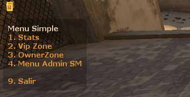

<p align="center">
    </a>&nbsp;
    <a href="https://wiki.alliedmods.net/Introduction_to_SourcePawn_1.7"> </a>&nbsp;
    <a href="https://www.sourcemod.net/"> </a>&nbsp;
    <a href="https://www.linkedin.com/in/johanvillamizar/"> </a>  
</p><br>

# Menu Simple
_This is a simple source code for preparing a menu in the SourcePawn language._

## Detailed description 🧾

This source code is intended for programmers who want to make their own menu based on the source code.

## Important ⚠️

Anyone can make use of this menu for their liking, however all the changes that you want to add or remove must be done from the source code and recompile the plugin again.

## Preview



## Version 1.0.1
```
In the first version the menu does not work due to programming errors _(my fault)_, they are already corrected and the code is functional.
```
* Fixed bugs that prevented the in-game menu from being displayed
* The option that allows to show and its respective time is added
* The option to exit in an optimal way is added according to the documentation.
* Added a README.md on Github

## Developer instructions

_They are commented out in the source code._

## Installation 🔧

Put the compiled code in the plugins folder

```
addons/sourcemod/plugins
```
---
❤️ by [Johan Villamizar](https://johanvillamizar.com) 😊